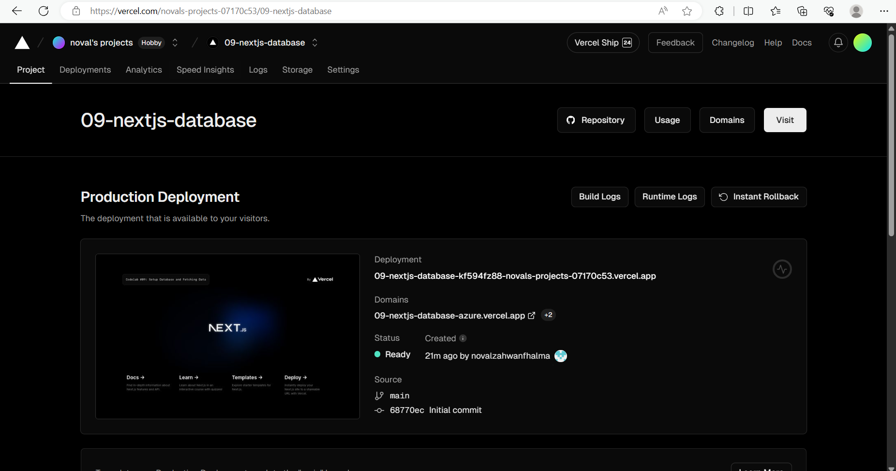
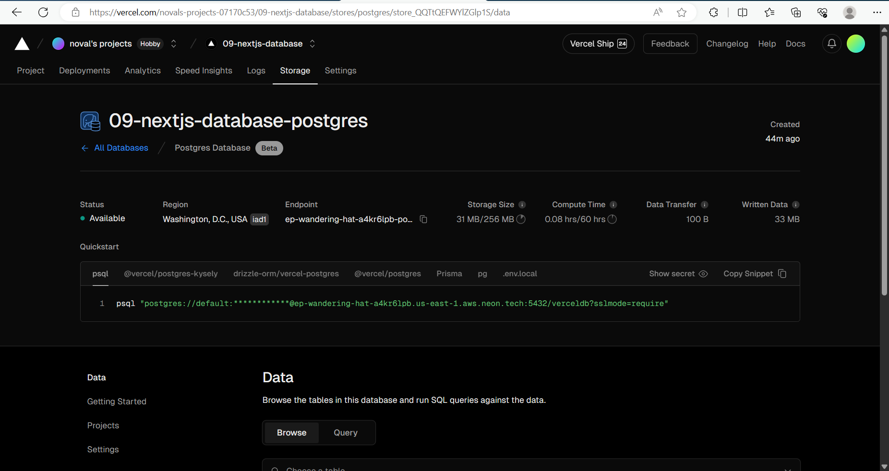
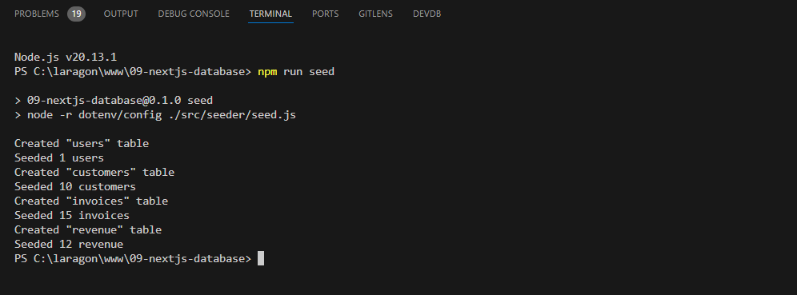

W09: Jawaban soal 1

berhasil me-deploy projek 09-next-database pada server vercel.

W09: Jawaban soal 2

berhasil membeuat postgres database, berhasil nge-copy file .env dari file .env.local, dan berhasil instal postgres vercel sdk.

W09: Jawaban soal 3

melakukan seed ke database dengan menambahkan "seed": "node -r dotnv/config ./src/seeder/seed.js"
